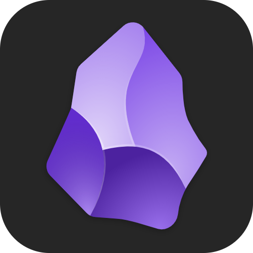

  

  <table>
    <tr style="background-color: #f9f9f9;">
      <td>🌟 <b>Step 5</b>: Advanced Machine Learning.</td>
      <td>
        
        
        
        
      </td>
    </tr>
    <tr>
      <td>🚀 <b>Step 4</b>: Data Eng., Pipelines & Viz.</td>
      <td>
        
        
        
      </td>
    </tr>
    <tr style="background-color: #f9f9f9;">
      <td>📊 <b>Step 3</b>: Data Science Foundations.</td>
      <td>
        
        
        
        
        
      </td>
    </tr>
    <tr>
      <td>🌐 <b>Step 2</b>: Web & Cloud.</td>
      <td>
        
        
        
        
      </td>
    </tr>
    <tr style="background-color: #f9f9f9;">
      <td>💻 <b>Step 1</b>: Core Tech.</td>
      <td>
        
        
        
        
        
      </td>
    </tr>
    <tr>
      <td>🏗️ <b>Step 0</b>: Operating Systems and Tools.</td>
      <td>
        
        
        
        
        
      </td>
    </tr>
  </table>
  

    <!-- 1. GitHub Followers -->
    
    <!-- 2. GitHub Stars -->
    
    <!-- 8. Stack Overflow Reputation -->
    
    <!-- 4. GitHub Contributions -->
    
    <!-- 5. Repo Count -->
    
    <!-- 7. GitHub Sponsors -->
    
    <!-- 10. GitHub Gists -->
    
    
    <!-- 6. Profile Last Updated -->
    
  

---

### 💻 IT Developer |  Data Analytics Specialist |  AI Enthusiast | 📚 Bookworm | 📷 Amateur Photographer

- 💻 **[Software Architecture](https://en.wikipedia.org/wiki/Software_architecture)**: Exploring and implementing full-stack solutions with a focus on scalability and performance.  
- 📊 **Data Analytics**:  
  - ✅ [A/B Testing](https://en.wikipedia.org/wiki/A/B_testing): Designing and analyzing experiments to optimize performance.  
  - 📈 Model Analysis: Specialist in techniques like [Random Forest](https://en.wikipedia.org/wiki/Random_forest) and [NLP](https://en.wikipedia.org/wiki/Natural_language_processing).  
  - 🎯 Delivering actionable insights through data-driven methodologies.  
- 🤖 **[AI Enthusiast](https://en.wikipedia.org/wiki/Artificial_intelligence)**: Leveraging tools like [ChatGPT](https://openai.com/chatgpt) to learn, experiment, and innovate in artificial intelligence.  
- 📝 **[Obsidian](https://obsidian.md/)** Fan: Organizing knowledge and ideas efficiently with Obsidian 

---

  [][lk]
  [][ig]
  [][gr]
  [][chess]
  [][lc] 

  

---

  <!-- GitHub Stats -->
  
  
  <!-- Top Languages -->
  

---

### 🎧 Spotify Playing
[Public playlist](https://open.spotify.com/playlist/6cZlnbJNn6P8Ad2GZ4YLis?si=515ff69023744a6c)

<!-- LINKS -->
[yt]: https://www.youtube.com/channel/UCABS8RZnJzGI_w9oauOvSxg?sub_confirmation=1
[ig]: https://www.instagram.com/jesuserro/
[lk]: https://www.linkedin.com/in/jesuserro/
[tw]: https://twitter.com/jesuserro
[gr]: https://www.goodreads.com/user/show/40291334-jes-s-erro
[lc]: https://lichess.org/@/olagato
[chess]: https://www.chess.com/member/olagato
[topics]: https://raw.githubusercontent.com/github/explore/80688e429a7d4ef2fca1e82350fe8e3517d3494d/topics
[obsidian]: https://obsidian.md

---

